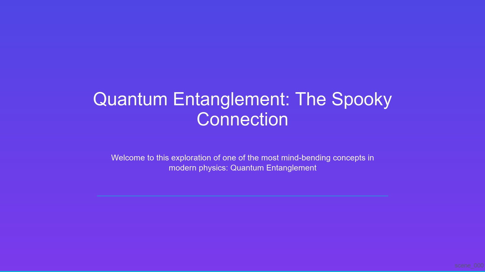
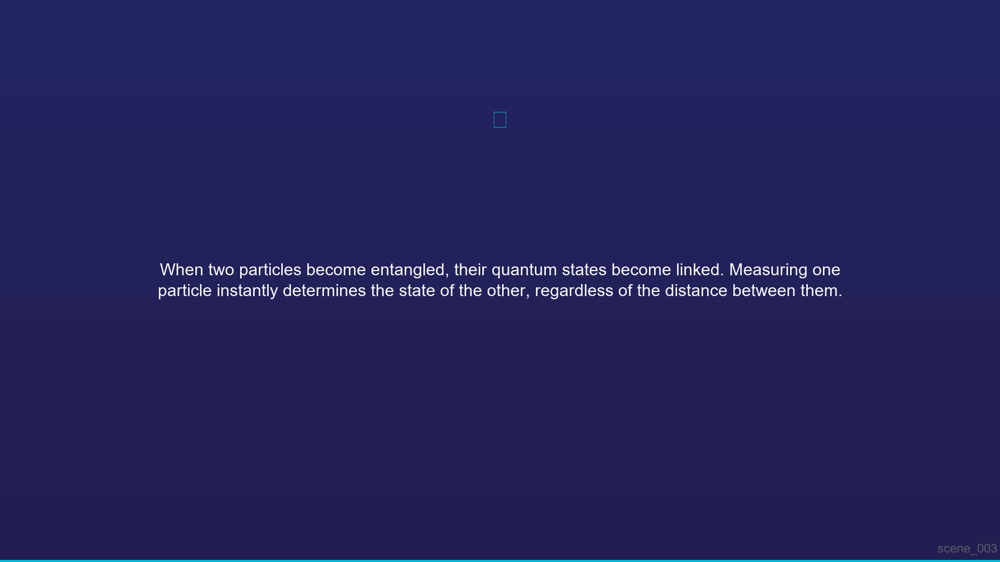
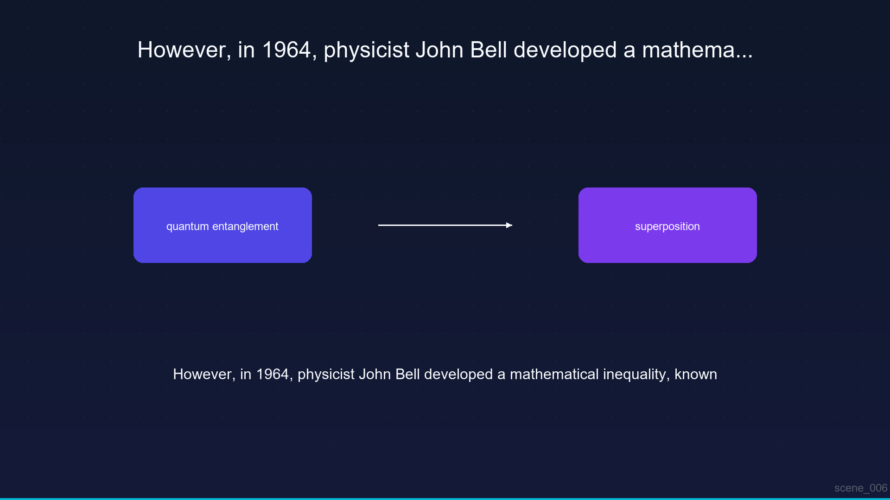

# Explainer Video Factory 🏭🎥

[](https://www.python.org/downloads/)
[](https://opensource.org/licenses/MIT)
[](https://github.com/psf/black)

A production-grade, multi-modal synchronous rendering pipeline that automatically transforms educational topics into polished, synchronized explainer videos. 

Built with **LangGraph**, **edge-tts**, **Pillow**, and **MoviePy**, this system uses a specialized multi-agent architecture to orchestrate script generation, dynamic visual rendering, and audio narration into a unified, perfectly synchronized timeline.

---

## 🎬 Demo Output

Watch the Explainer Video Factory in action! Here is a completely automated, generated video on the topic of **Quantum Entanglement**.

> **Note:** GitHub does not always natively embed `.mp4` files seamlessly in all markdown viewers, but you can download or view the raw generated video here:
> 
> ▶️ **[Watch the Final Generated Video Showcase](docs/assets/demo_video.mp4)**

---

## 🖼️ Example Generated Slides

The **Visuals Agent** automatically generates stylized 1080p slide layouts based on the context of the script. Here are examples of different scene types generated entirely by code (no templates or external assets required):

| Title Slide | Explanation Slide | Diagram Slide |
| :---: | :---: | :---: |
|  |  |  |
| *Automatically generated typography and visual hierarchy* | *Text layouts with dynamic sizing based on narration length* | *Procedural diagram rendering based on extracted keywords* |

---

## 🌟 Key Features

* **Multi-Agent Orchestration**: Uses LangGraph to manage dedicated Avatar, Visuals, and Synthesis agents with robust error recovery.
* **Synchronized Timeline**: Automatically probes actual audio file lengths to align narration duration exactly with visual scene display time—ensuring no narration overlap.
* **CPU-Bound Rendering**: Generates beautiful 1080p visuals using Python's Pillow library — zero GPU required!
* **High-Quality TTS**: Uses Microsoft Edge TTS for natural, expressive narration with word-level timing extraction.
* **Template & LLM Scripting**: Includes offline educational templates with built-in fallback to LLM (OpenAI/Anthropic) APIs.
* **FastAPI Server**: Includes an asynchronous web API for triggering and monitoring long-running background rendering jobs.

---

## 🏗️ Architecture & Rendering Pipeline

The factory pipeline operates in several distinct stages, orchestrated by LangGraph into a fault-tolerant state machine:

1. **Script Generation (Avatar Agent)**: Expands a given topic into an educational script broken down into logical segments.
2. **Scene Planning (Visuals Agent)**: Parses the script segments and assigns visual templates (Title, Diagram, Analogy, Summary, etc.).
3. **Parallel Rendering**:
   - *Avatar Agent* generates TTS audio and extracts actual playback durations.
   - *Visuals Agent* draws 1080p PNG images based on the assigned theme, colors, and scene type.
4. **Synthesis (Synthesis Agent)**: Assembles the generated audio and images using MoviePy, applies crossfade transitions, generates `.srt` subtitles, and encodes the final synchronized `.mp4`.

*For deep dives into the system design, see [Architecture](docs/architecture.md) and [Agent Workflow](docs/agent_workflow.md).*

---

## 🚀 Quickstart

### Prerequisites

- Python 3.10 or higher
- System `ffmpeg` is **not** required! (Provided automatically via `imageio-ffmpeg`)

### Installation

Clone the repository and install the dependencies:

```bash
git clone https://github.com/sinharea/Explainer-Video-Factory.git
cd Explainer-Video-Factory

# Create a virtual environment
python -m venv .venv
source .venv/bin/activate  # On Windows: .venv\Scripts\activate

# Install the package and dependencies
make install
```

### Running the CLI Demo

Generate a complete video about "Quantum Entanglement" directly from the command line. This triggers the full pipeline and outputs the final MP4.

```bash
make run-demo
```
*Outputs will be saved in `examples/outputs/`.*

### Starting the API Server

Launch the FastAPI background worker server to dispatch rendering jobs via REST:

```bash
make run-api
```
*API documentation and interactive Swagger UI will be available at [http://localhost:8000/docs](http://localhost:8000/docs).*

---

## 📁 Project Structure

```
Explainer-Video-Factory/
├── src/explainer_factory/
│   ├── agents/         # LangChain/LangGraph Agents (Avatar, Visuals, Synthesis)
│   ├── api/            # FastAPI application and routes
│   ├── models/         # Pydantic data models for state management
│   ├── orchestrator/   # LangGraph state machine definition
│   ├── pipeline/       # Script, Scene, and Timeline logic
│   ├── renderers/      # TTS, Visual, and Video rendering engines
│   └── utils/          # File and media helpers
├── tests/              # Pytest unit testing suite
├── scripts/            # CLI runners and demo scripts
├── docs/               # Documentation & Visual Assets
└── assets/             # Fonts, global configurations, and themes
```

## 🛠️ Configuration

Configuration is managed via `pydantic-settings`. Create a `.env` file from the provided example:

```bash
cp .env.example .env
```

Key settings include:
- `VIDEO_WIDTH` / `VIDEO_HEIGHT`: Output resolution (Default: 1920x1080)
- `TTS_VOICE`: edge-tts voice model (Default: `en-US-AriaNeural`)
- `LLM_PROVIDER`: Set to `openai` or `anthropic` to enable dynamic script generation.

## 📝 License

This project is licensed under the MIT License - see the [LICENSE](LICENSE) file for details.
